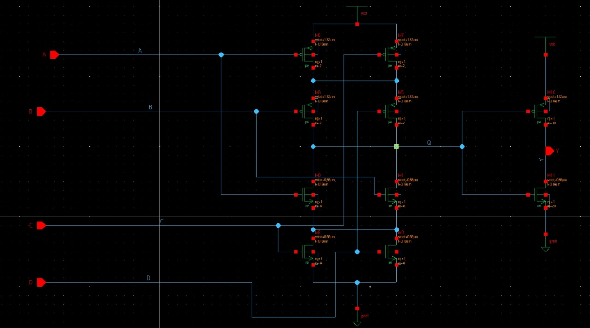
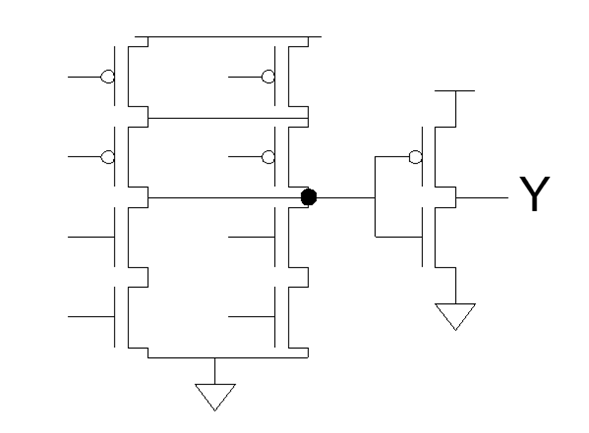
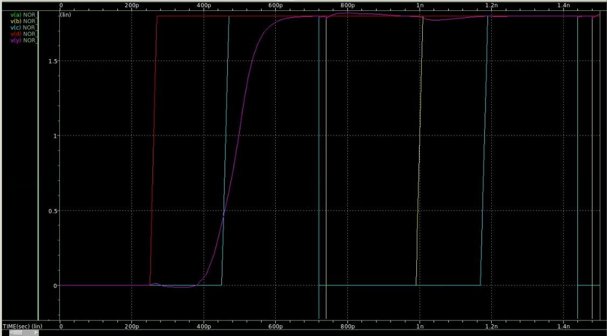
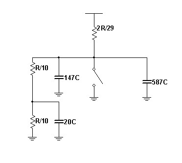
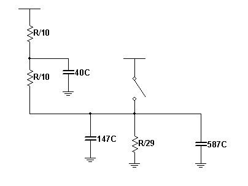
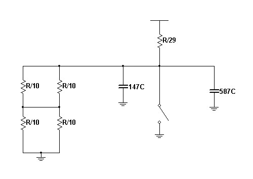
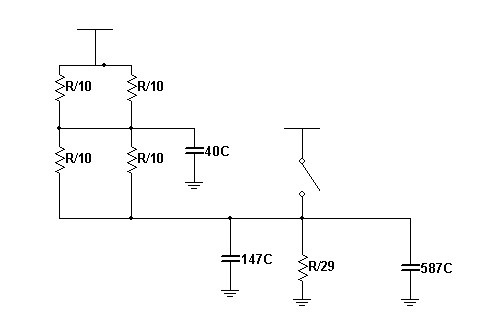
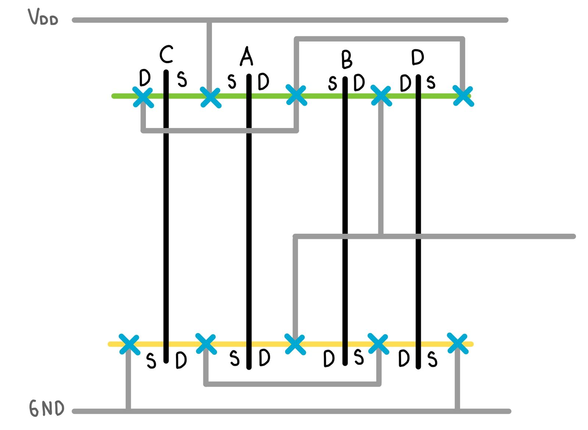
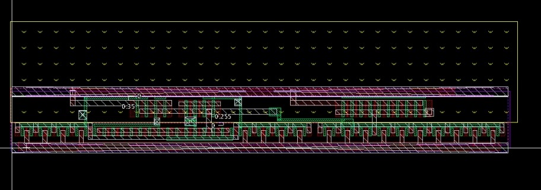
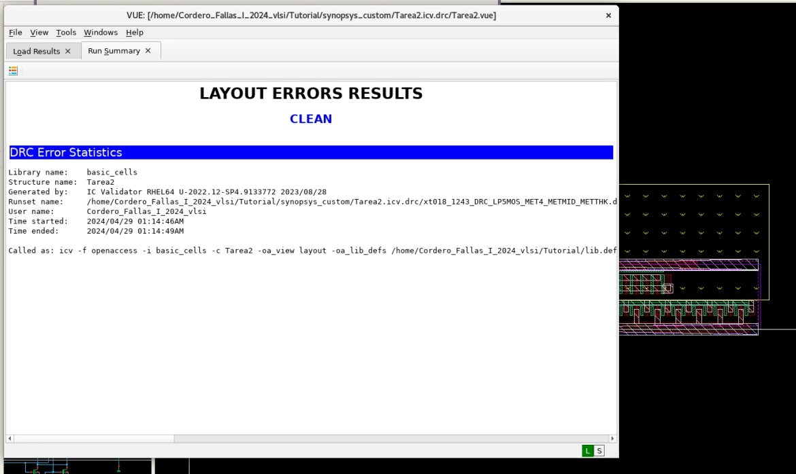

# Informe Tarea2_VLSI
## Emanuel Cordero Fallas y Yerlyn Mora Artavia
## Introducción
En este repositorio se encuentran los archivos utilizados para la resolución de la tarea 2 del curso así como el presente informe de los resultados obtenidos.

## Problema
Se debe diseñar una compuerta CMOS que resuelva la operación Y=(A+B)(C+D), una de las soluciones debe ser por medio de una compuerta compleja y la otra debe ser utilizando varias etapas sencillas.

## Solución por compuerta compleja
Primeramente se plantea el circuito que representa la ecuación booleana, debido a que la lógica CMOS presenta una salida negada se añade un inversor al final. El esquemático final es el siguiente:

Para el tamaño de los transistores se realizó el análisis de esfuerzo lógico, teniendo en cuenta los anchos máximos y la carga máxima estipulada se obtuvo que para la compuerta compleja los PMOS deben tener un tamaño de 20 transistores unitarios mientras que los NMOS un tamaño de 10 transistores unitarios. Para el caso del inversor el PMOS debe ser de tamaño 29 y el NMOS de tamaño 58.

Luego de calcular los tamaños de cada uno de los transistores, se monta el esquemático en el simulador y se verifica su funcionalidad, contrastandolo con la tabla de verdad.

### Estimación de Potencia
Para el cálculo de la potencia de la compuerta se utilizó la siguiente expresión:

$$P_{sw}= \alpha \cdot C \cdot V_{DD}^2 \cdot f_{sw}$$

El periodo de reloj maximo utilizado fue de 600ps lo que equivale a una frecuencia de 1.67 GHz, con este dato y asumiendo un factor de actividad de 0.5 para cada una de las entradas se tiene que la potencia dinámica de la compuerta es de:

$$P_{sw}= 0.5 \cdot 0.483fF \cdot 1.8^2 \cdot 1.67 GHz$$

Obteniendo que la potencia de la compuerta es de $$P_{sw}= 1.31 \mu W$$

### Cálculo de retardos de Elmore
Para los retardos de elmore primero se calcula el retardo de la carga y descarga del inversor para luego analizar la compuerta compleja sin el inversor y sumar ambos retardos.

* Tiempos de propagación: Para los tiempos de propagación se plantea el peor caso de carga y descarga en la compuerta. Para el cálculo de los retardos de propagación se utilizaron los siguientes casos:

  * tpdr: Para el tiempo de rise, se debe calcular cuando la compuerta compleja da un 0 como salida ya que el inversor se encargará de proporcionar el 1.
 
   

    $$t_{pdr} = \frac{R}{10} \cdot 20C + \frac{R}{5} \cdot 147C + \frac{R}{29} \cdot 587C$$
    $$t_{pdr} = 51,64RC$$

  * tpdf: Para el tiempo de fall, se debe calcular cuando la compuerta compleja da un 1 como salida ya que el inversor se encargará de proporcionar el 0.
 
    

    $$t_{pdf} = \frac{R}{10} \cdot 40C + \frac{R}{5} \cdot 147C + \frac{R}{58} \cdot 587C$$
    $$t_{pdr} = 43,52RC$$

* Tiempos de contaminación: Para estos tiempos se plantean los mejores casos que puede presentar la compuerta, es decir, cuando la capacitancia que se debe cargar o descargar es menor:
  

  
  * tcdr: Para el tiempo de rise, se debe calcular cuando todos los NMOS están encendidos y se asume que las capacitancias de los nodos inferiores en la compuerta ya han sido descargadas en el ciclo anterior, luego se suma el retardo del inversor.
 

    $$t_{cdr} = \frac{R}{10} \cdot 147C + \frac{R}{29} \cdot 587C$$
    $$t_{cdr} = 34,94RC$$

    * tcdf: Para el tiempo de fall, se debe calcular cuando todos los PMOS están encendidos luego se suma el retardo del inversor.
 

    $$t_{cdf} = \frac{R}{20} \cdot 40C + \frac{R}{10} \cdot 147C + \frac{R}{29} \cdot 587C$$
    $$t_{cdf} = 36,94RC$$

### Contraste con simulación
Para obtener los retardos exactos se sustituye los valores obtenidos en la tarea anterior, siendo así $$R=12,84 k \Omega$$ y $$ C=0,483 fF$$. Una vez obtenidos estos valores, se crean las condiciones necesarias para medir los retardos en el simulador de custom compiler obteniendo los siguientes resultados:

|     |  Teórico  |  Simulado  | Diferencia    |
|  :---           |  ---:   |  :---:  |  ---   |
|  $t_{cdr} (ps)$ |  229,09 |  346,13 | 117,04 |
|  $t_{cdf} (ps)$ |  216,69 |  190    | 26,69  |
|  $t_{pdr} (ps)$ |  333,9  |  232    | 101,9  |
|  $t_{pdf} (ps)$ |  269,9  |  149    | 120,9  |

Se observó que la diferencia entre los datos teóricos y simulados es muy poca, lo cual indica que los retardos teóricos son útiles para obtener una aproximación de la compuerta y determinar si se deben realizar modificaciones de algún tipo, pero siempre es importante obtener los datos simulados para una medición más precisa.

### Layout de la compuerta
Una vez contrastados los datos teóricos y simulados se procedió a trazar el diagrama de palitos y el layout de la misma:

Así mismo, una vez trazado el layout se procedió a hacer la verificación DRC hasta corregir todos los errores y obtener el modelo final.

## Solución por compuerta simple 
Al realizar el análisis por medio de etapas sencillas, en la siguiente figura se muestra lo obtenido.  

A partir del esfuerzo lógico, se obtuvo el tamaño de los transistores PMOS y NMOS en cada una de las etapas. En la primera etapa, conformada por una compuerta NOR se tiene un tamaño igual a 6 para los PMOS y de 24 para los NMOS. En la segunda etapa, conformada por una compuerta NOR, se tiene un tamaño igual a 13 para los PMOS y de 52 para los NMOS. Mientras que en el inversor, a la salida, se tiene un PMOS con tamaño igual a 47 y un NMOS con un tamaño de 93. En la siguiente figura se muestra el esquemático con los tamaños requeridos. 

En la siguiente figura se muestra la verificación del comportamiento esperado de la compuerta, obtenido al realizar la simulación con el esquemático presentado. 

### Estimación de potencia 
#### Cálculos del retardo Elmore
Para obtener el retardo total de propagación y contaminación, se dividió en cada una de las etapas y luego se sumaron los resultados. Se toman en cuentan el peor caso de carga y descarga en la compuerta. En las siguientes figuras se muestran los circuitos equivalentes. 

A continuación se muestran los cálculos para cada uno de los casos. 

$$t_{pdr} = \frac{R}{3} \cdot 6C + (\frac{R}{3} + \frac{R}{3}) \cdot 109C + \frac{2R}{13} \cdot 13C + (\frac{2R}{13} + \frac{2R}{13}) \cdot 257C + \frac{R}{93} \cdot 640C$$

$$t_{pdr} = 237, 30 RC$$

$$t_{pdf} = \frac{R}{24} \cdot 109C + \frac{R}{52} \cdot 257C + \frac{R}{93} \cdot 640C$$

$$t_{pdf} = 20, 90 RC$$

$$t_{cdr} = (\frac{R}{3} + \frac{R}{3}) \cdot 109C + (\frac{2R}{13} + \frac{2R}{13}) \cdot 257C + \frac{2R}{47} \cdot 640C$$

$$t_{cdr} = 251, 65 RC$$

$$t_{cdf} = \frac{R}{24} \cdot 109C + \frac{R}{52} \cdot 257C + \frac{R}{93} \cdot 640C$$

$$t_{cdf} = 20, 90 RC$$

#### Contraste con simulación
En la siguiente tabla se muestra el contraste entre los datos calculados teóricamente y los obtenidos a través de la simulación. 

|     |  Teórico  |  Simulado  | Diferencia    |
|  :---           |  ---:   |  :---:  |  ---   |
|  $t_{cdr} (ps)$ |  251, 65 | 299, 17  | 47, 52  |
|  $t_{cdf} (ps)$ |  20,90   |  64, 79  | 43, 89  |
|  $t_{pdr} (ps)$ |  237,30  | 309, 90  | 72, 06  |
|  $t_{pdf} (ps)$ |  20,90   |  5, 37   | 15, 53  |

A partir de los resultados, se puede observar cómo la diferencia entre los datos es relativamente poca. Por lo que, se puede confirmar que los circuitos equivalentes para calcular los datos teóricamente, ayudan a obtener la aproximación de cada tiempo de retardo, sin embargo, su exactitud podría ser más cercana con los datos a partir de una simulación. 

#### Layout de la compuerta 
Para modelar el layout, primero se realizó el Diagrama de Palitos a partir del esquemático obtenido. Al tener tres etapas, se separó el diagrama de cada una de ellas y se conectaron a través de sus respectivas entradas/salidas. A continuación se muestra el Diagrama de Palitos obtenido. 

A partir del Diagrama de Palitos se realizó el layout para la compuerta, el cual se muestra a continuación. 

Finalmente, se muestra el resultado de la verificación DRC. 

